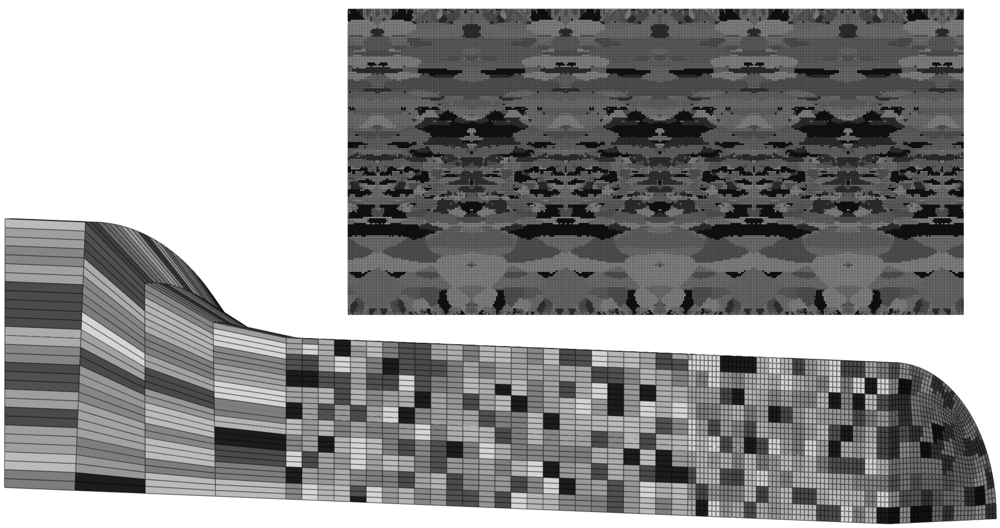

# Texture2Abaqus

Generates Abaqus include files from the crystallographic texture of an alloy for crystal plasticity finite element analyses. The generated texture can be random, generated from orientation data, X-ray polefigure data or an EBSD scan.

## Getting Started

To get a local copy up and running follow these simple steps.

1. Clone the project (`git clone --recursive https://github.com/frodal/Texture2Abaqus.git`)
2. Download and install the latest version of [Matlab](https://software.ntnu.no/ntnu/matlab)
3. Download and install the latest version of the [MTEX toolbox](https://mtex-toolbox.github.io/download)
4. Go into the `./src` folder and open `Main.m` in Matlab
5. Change the input fields according to your preferences and run the script

## Usage

- Setup your copy of the repository by following the description above
- Change the input fields in `./src/Main.m` according to your preferences and run the script

## License

See `LICENSE.md` for more information.

## Contributing

To contribute:

1. Fork the Project
2. Create your Feature Branch (`git checkout -b feature/AmazingFeature`)
3. Commit your Changes (`git commit -m 'Add some AmazingFeature'`)
4. Push to the Branch (`git push origin feature/AmazingFeature`)
5. Open a Pull Request

## Contact

Bjørn Håkon Frodal - [@frodal](https://github.com/frodal) - bjorn.h.frodal@ntnu.no
